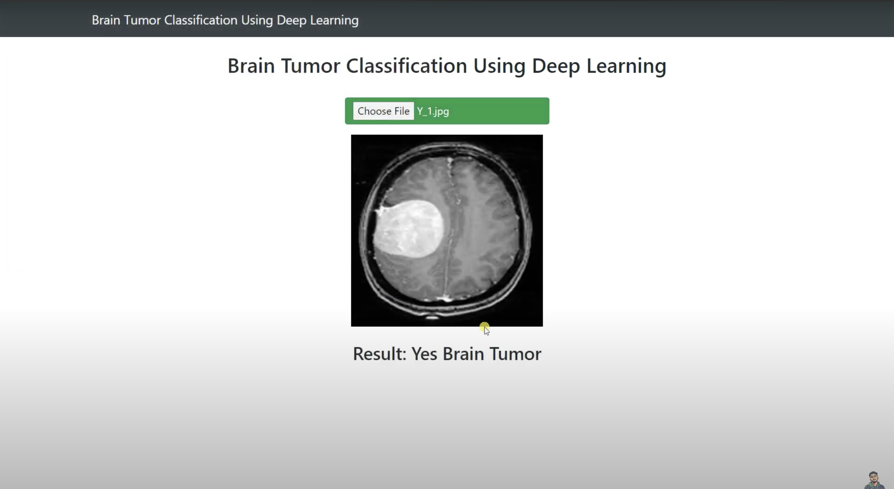

# Brain Tumor Classification using Deep Learning


A web application that uses a deep learning model to classify brain MRI scans as either containing a tumor or not. This project leverages a Convolutional Neural Network (CNN) based on the VGG19 architecture, demonstrating the power of transfer learning for medical image analysis.


## 📋 Features
* **Web Interface:** An easy-to-use interface built with Flask for uploading brain MRI images.
* **Deep Learning Model:** Utilizes a pre-trained VGG19 model with a custom classification head for high accuracy.
* **Transfer Learning:** The convolutional base of VGG19 is used as a fixed feature extractor, significantly reducing training time and data requirements.
* **Real-time Prediction:** Get an instant classification result ("Brain Tumor Detected" or "No Brain Tumor Detected") after uploading an image.

---
## 💻 Technology Stack
* **Backend:** Flask
* **Deep Learning:** TensorFlow, Keras
* **Image Processing:** OpenCV, Pillow (PIL)
* **Numerical Operations:** NumPy

---
## 🚀 Setup and Usage

Follow these steps to set up and run the project locally.

### 1. Clone the Repository
```bash
git clone [https://github.com/your-username/Brain-Tumor-Detection.git](https://github.com/your-username/Brain-Tumor-Detection.git)
cd Brain-Tumor-Detection
```
# Create a new conda environment with Python 3.11
```bash
conda create --name brainenv python=3.11 -y
```
# Activate the environment
```bash
conda activate brainenv
```

```bash
pip install -r requirements.txt
```

## Download Model Weights
-**Make sure you have the pre-trained model weights file vgg_unfrozen.weights.h5 in the root directory of the project.**

## Run the Flask Application
```bash
python app.py
```

## Access the Web Interface
- Open your web browser and navigate to the following address:
http://127.0.0.1:5000
- You can now upload a brain MRI image to get a classification.

## 🧠 Model Architecture
The model is built using the transfer learning technique:
- **Base Model:** A pre-trained VGG19 model, with its weights frozen. This acts as a powerful feature extractor.
- **Custom Head:** On top of the VGG19 base, a custom classifier is added, consisting of:
  -  Flatten layer.
  -  Two Dense (fully connected) layers with ReLU activation.
  -  A Dropout layer to prevent overfitting.
  -  A final Dense output layer with softmax activation for binary classification.
 
## 🖼️ Screenshots

### Flask Web-Page



## 👨‍💻 Author - **Akshat Pratap Singh** 
- **GitHub:** https://github.com/Akshat48002/Brain-Tumor-Detection.git
- **Email:** akshatpratapsingh482002@gmail.com

 

